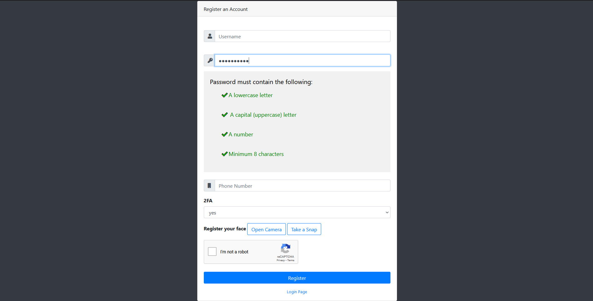

# LockBox

File uploading site with an emphasis on security, developed for a school project.

prod by blvnk.

## About

LockBox is a secure file storage & file-sharing site. It is focused on data security, ensuring the safety of files & sensitive information.

### Signup

## Getting Started

### Dependencies

prequisites.

### Installing

how to download / install.

### Execution

how to run.

## License

This project is licensed under the terms of the MIT license.

## Credits

- blvnk