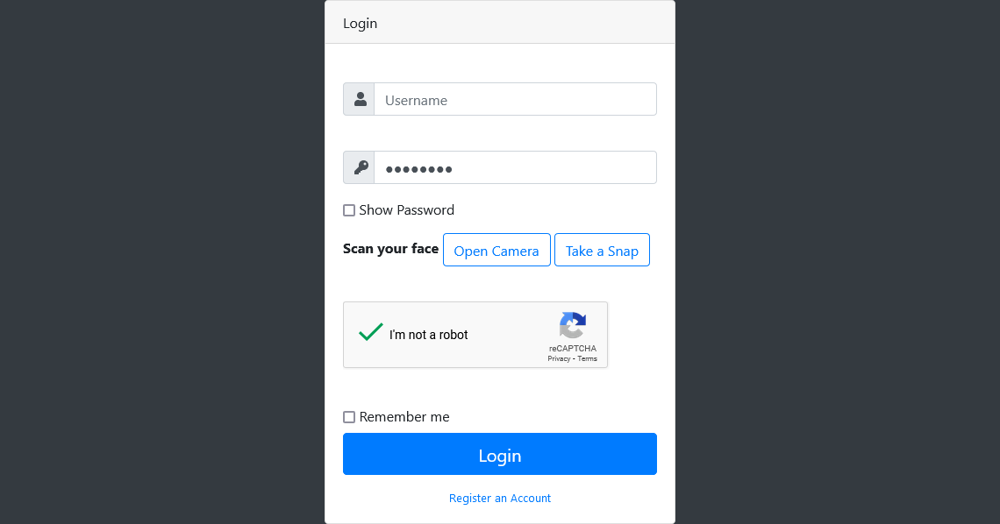
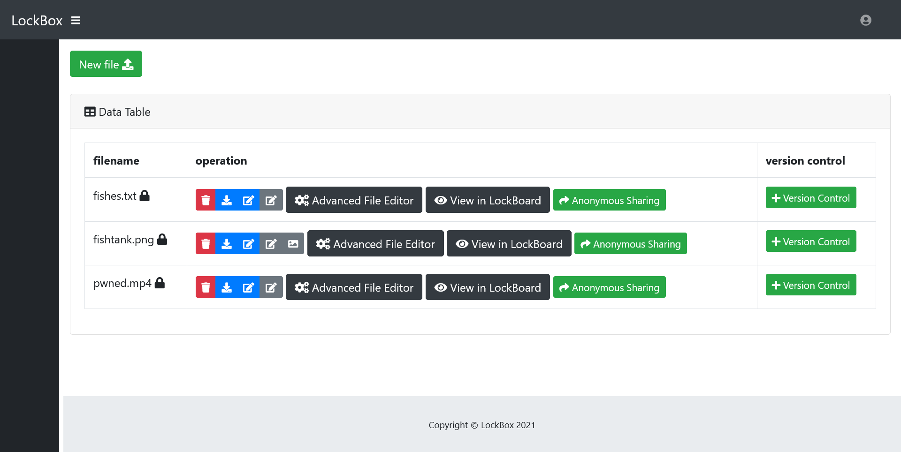
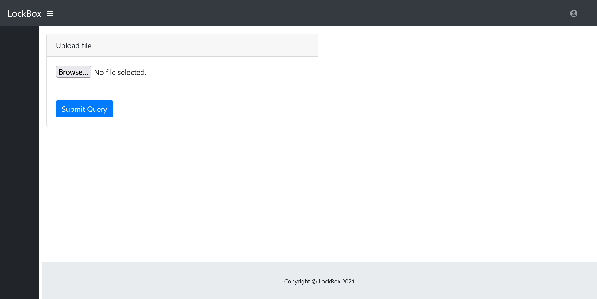
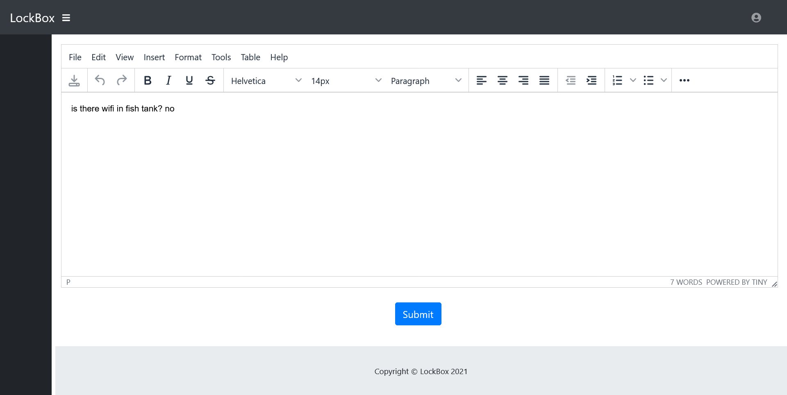
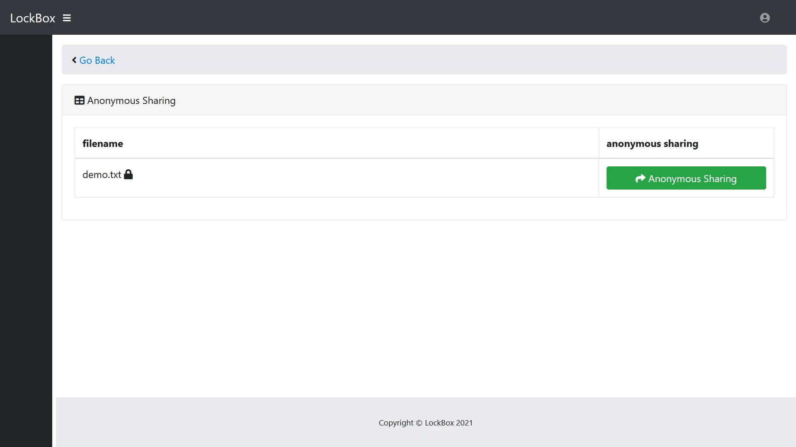

# LockBox

File uploading site with an emphasis on security, developed for a school project.

prod by blvnk.

## About

LockBox is a secure file storage & file-sharing site. It is focused on data security, ensuring the safety of files & sensitive information.

### Signup / Login

**Signup**

**Login**

- Client-Side Password Validation
- Server-Side Machine Learning via SVM (Support Vector Machine)
- 2FA with Phone Number w/ Twilio
- Facial Recognition (not fully implemented)

### Home Page

### File Operations

**File Upload**

**Text Editor**

- File Download
- File Deletion

### Anonymous Sharing

Notes:

- Generates a random URL as file link.

### Version Control

### Additional Features

- CSRF Tokens
- CAPTCHA w/ reCAPTCHA
- Malware Checking w/ Virus Total
- NER (Named Entity Recognition) to Extract Potentially Identifiable Information in Text Files

## Getting Started

### Dependencies

prequisites.

### Installing

how to download / install.

### Execution

how to run.

## License

This project is licensed under the terms of the MIT license.

## Credits

- blvnk
- edwin
- aden
- mark
