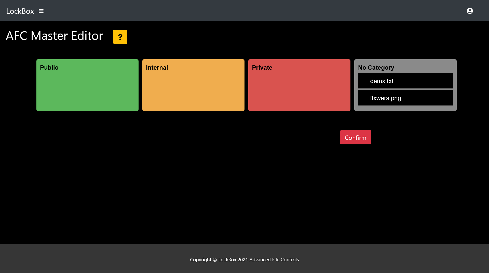

    
    <h1>LockBox</h1>

---

Table of Contents

- [About](#about)
- [Demo](#demo)
  - [Signup / Login](#signup--login)
  - [Home Page](#home-page)
  - [File Operations](#file-operations)
  - [Anonymous Sharing](#anonymous-sharing)
  - [Version Control](#version-control)
  - [Advanced File Controls](#advanced-file-controls)
  - [Additional Features](#additional-features)
- [Getting Started](#getting-started)
  - [Prerequisites](#prerequisites)
  - [Execution](#execution)
- [License](#license)
- [Built With](#built-with)
- [Credits](#credits)

## About

LockBox is a secure file storage & file-sharing site. It is focused on data security, ensuring the safety of files & sensitive information.

prod by blvnk.

## Demo

### Signup / Login

**Signup**

**Login**

- Client-Side Password Validation
- Server-Side Machine Learning via SVM (Support Vector Machine)
- 2FA with Phone Number w/ Twilio
- Facial Recognition (not fully implemented)

### Home Page

### File Operations

**File Upload**

**Text Editor**

- File Download
- File Deletion

### Anonymous Sharing

Notes:

- Generates a random URL as file link.

### Version Control

### Advanced File Controls

**Text File Controls**

**Image File Controls**

**Bulk Editor**

**LockBoard (Dashboard)**

|     Feature     | Text | Image |
| :-------------: | :--: | :---: |
| File Encryption |  ✔   |   ✔   |
| Session Timeout |  ✔   |   ✔   |
|   File Expiry   |  ✔   |   ✔   |
|    Max Views    |  ✔   |   ✔   |
|    Watermark    |  ✖   |   ✔   |

### Additional Features

- CSRF Tokens
- CAPTCHA w/ reCAPTCHA
- Malware Checking w/ Virus Total
- NER (Named Entity Recognition) to Extract Potentially Identifiable Information in Text Files

## Getting Started

### Prerequisites

**Environmental Variables**

Create `.env` file in root directory.

    RECAPTCHA_PUBLIC_KEY=
    RECAPTCHA_PRIVATE_KEY=
    TWILIO_ACCOUNT_SID=
    TWILIO_AUTHTOKEN=
    TWILIO_VERIFY_SID=
    DB_PATH=database/lockbox.db
    VIRUS_TOTAL_KEY=

- reCAPTCHA: [Google reCAPTCHA Admin Console](https://www.google.com/recaptcha/admin)
- Twilio Account: [Twilio Account Dashboard](https://www.twilio.com/console)
- Twilio Verify Service: [Twilio Verify Service](https://www.twilio.com/console/verify/services)
- VirusTotal: [VirusTotal API Key](https://support.virustotal.com/hc/en-us/articles/115002088769-Please-give-me-an-API-key)

**Install Dependencies**

    pip install -r requirements.txt

### Execution

    py main.py

## License

This project is licensed under the terms of the MIT license.

## Built With

- [Flask](https://flask.palletsprojects.com)
- [Bootstrap](https://getbootstrap.com)
- [reCAPTCHA](https://www.google.com/recaptcha)
- [Twilio](https://www.twilio.com)
- [VirusTotal](https://www.virustotal.com)

## Credits

- blvnk
- edwin
- aden
- mark
